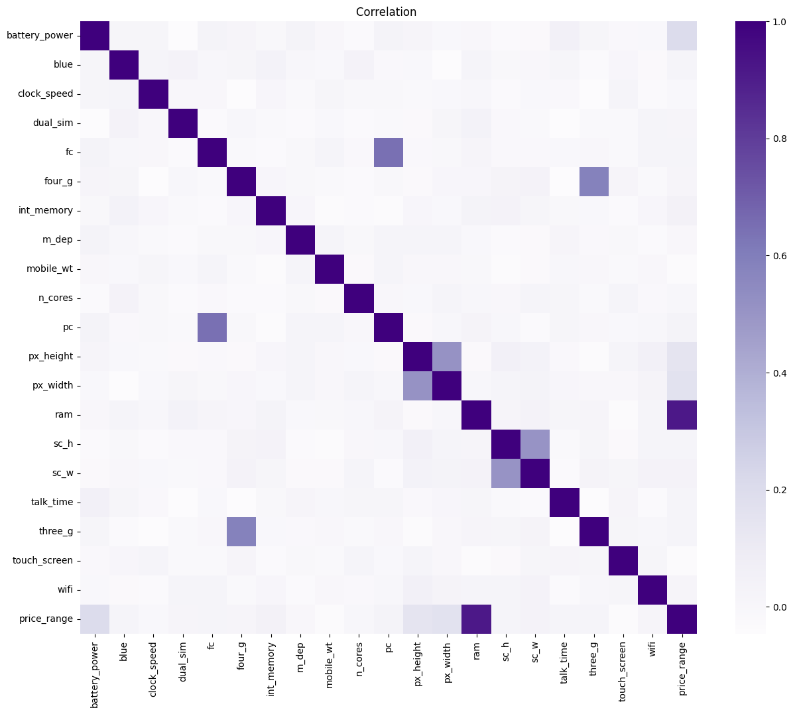
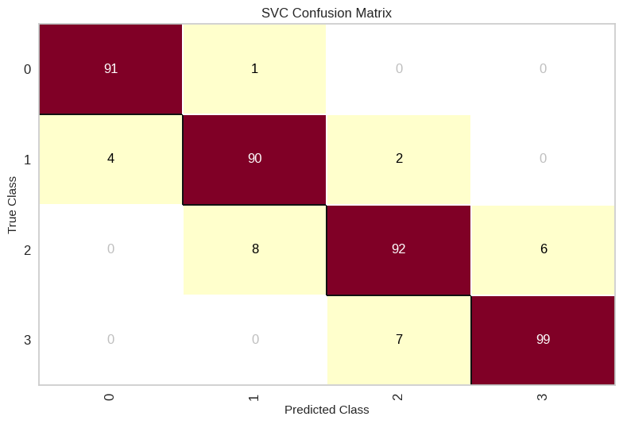

# 📱 Mobile Price Classification using SVM

## 📌 Overview
This project aims to classify smartphone price categories using **Support Vector Machine (SVM)** based on technical specifications.
This model can help businesses understand key factors influencing smartphone pricing and support data-driven pricing strategies.

---

## 🎯 Objective
- Predict smartphone price category (0–3)
- Identify key features influencing price
- Build and optimize classification model

---

## 📊 Dataset
- 1000 smartphone records  
- 20 features  
- Target: `price_range`

---

## 🔍 Key Insights
- RAM is the most influential feature  
- Screen resolution has moderate impact  
- Connectivity features have low impact  

---

## ⚙️ Methodology
- Data Cleaning  
- Exploratory Data Analysis (EDA)  
- Train-test split (80:20)  
- Feature Selection  
- Model Training (SVM)  
- Hyperparameter Tuning  

---

## 🤖 Model Performance
- Train Accuracy: **95%**  
- Test Accuracy: **93%**

---

## 📊 Visualization

### Heatmap

### Confusion Matrix

---

## 🧠 Best Features
- RAM  
- Battery Power  
- px_height  
- px_width  

---

## 🚀 Future Improvements
- Try other models  
- Build Streamlit app  

---

## 👤 Author
Karina Wahyu
